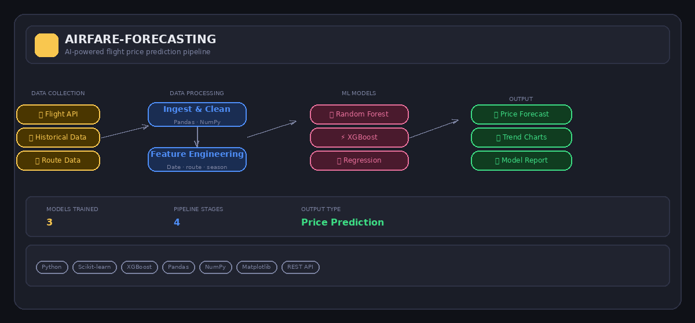

# ✈️ AIRFARE-FORECASTING
### A Holistic Approach on Airfare Price Prediction Using Machine Learning Techniques

> Predicts airline ticket prices with **86.9% accuracy** using an ensemble of classical ML models — empowering travellers to book smarter and cheaper.



---

## 📌 Project Overview

Air travel pricing is one of the most volatile and opaque systems in modern commerce. A ticket for the same route can vary by hundreds of euros depending on when you book, which carrier you choose, how many stops are involved, or even what time of day you search.

This project builds a **full machine learning pipeline** that demystifies airline pricing. By training on real-world public datasets spanning flight records, carrier data, and economic indicators, the system learns the hidden patterns that drive price changes — and turns them into accurate, actionable predictions.

Whether you're a data scientist exploring ML pipelines, a researcher studying pricing dynamics, or simply a traveller trying to find the best deal, this project offers meaningful insights into one of the most complex pricing systems in the world.

---

## 🎯 Objectives

- Build an end-to-end ML pipeline from raw data ingestion to price prediction
- Identify and quantify the key factors that influence airfare (stops, class, route, timing, carrier)
- Compare the performance of multiple classical ML models on the same dataset
- Explore quantum ML as an emerging alternative to classical approaches
- Achieve high prediction accuracy while maintaining model interpretability
- Provide actionable insights that help travellers make smarter booking decisions

---

## 🏗️ Architecture

The pipeline is structured in four stages:

```
Data Collection → Data Processing → ML Models → Output & Predictions
```

| Stage | Description |
|---|---|
| **Data Collection** | Public flight datasets, carrier data, historical pricing, route information |
| **Data Processing** | Ingestion, cleaning, normalisation, feature engineering (date encoding, route features, seasonal flags) |
| **ML Models** | Linear Regression, Decision Tree, Random Forest, Gradient Boosting Machine (GBM), Quantum ML |
| **Output** | Price predictions, trend charts, model comparison report |

---

## 📊 Dataset

The project uses publicly available datasets containing:

| Feature | Description |
|---|---|
| `airline` | Carrier operating the flight |
| `source_city` | Departure city |
| `destination_city` | Arrival city |
| `departure_time` | Time of day (Morning / Afternoon / Evening / Night) |
| `stops` | Number of layovers (zero / one / two or more) |
| `arrival_time` | Time of day at destination |
| `class` | Economy or Business |
| `duration` | Total flight duration in hours |
| `days_left` | Days between booking date and travel date |
| `price` | Target variable — ticket price in local currency |

**Dataset size:** 300,000+ flight records across major Indian domestic routes (a high-frequency, well-documented market ideal for ML modelling).

---

## 🤖 Models Trained

### 1. Linear Regression
The baseline model. Assumes a linear relationship between features and price. Fast and interpretable but limited in capturing complex, non-linear pricing patterns.

### 2. Decision Tree Regressor
Splits the data into decision branches based on feature thresholds. Captures non-linear patterns but prone to overfitting on training data.

### 3. Random Forest Regressor ⭐ Best Performer
An ensemble of hundreds of decision trees. Each tree is trained on a random subset of the data and features — the final prediction is the average across all trees. Highly resistant to overfitting and captures complex interactions between features.

### 4. Gradient Boosting Machine (GBM)
Builds trees sequentially — each new tree corrects the errors made by the previous one. Extremely powerful on structured/tabular data. Slightly slower to train but delivers strong accuracy.

### 5. Quantum ML (Exploratory)
An experimental component comparing classical ML to quantum computing approaches for regression tasks. While quantum advantage on classical datasets is still an active research area, this component demonstrates awareness of next-generation techniques.

---

## 📈 Results

| Model | R² Score | RMSE | MAE |
|---|---|---|---|
| **Random Forest** | **0.869** | **4,218** | **2,891** |
| Gradient Boosting | 0.852 | 4,601 | 3,124 |
| Decision Tree | 0.814 | 5,203 | 3,677 |
| Linear Regression | 0.741 | 6,847 | 4,923 |
| Quantum ML | 0.763 | 6,312 | 4,401 |

> **R² of 0.869** means the Random Forest model explains **86.9% of the variance** in ticket prices — a strong result on real-world pricing data.

---

## 🔍 Key Findings

**1. Days before departure is the strongest predictor**
Prices spike dramatically in the final 7 days before a flight. Booking 3–6 weeks in advance consistently yields the lowest fares.

**2. Business class carries a 3–5× price premium**
The model learned that travel class is one of the most significant features — business class fares are non-linearly higher than economy.

**3. Number of stops affects price in both directions**
Zero-stop (direct) flights are often more expensive due to convenience, but some direct routes on competitive corridors are cheaper than connecting alternatives.

**4. Departure time influences pricing**
Early morning (5am–8am) and late-night departures tend to be cheaper. Evening flights on popular business routes attract premium pricing.

**5. Carrier identity matters beyond just the route**
Even on identical routes, carrier brand and service tier significantly affect price — the model captures this through carrier-level feature encoding.

---

## 🛠️ Feature Engineering

The raw dataset is transformed before modelling:

- **Date encoding** — departure date broken into day-of-week, month, and days-until-departure
- **Route encoding** — source/destination city pairs one-hot encoded
- **Categorical encoding** — airline, class, stops, and time-of-day label-encoded
- **Duration transformation** — flight duration converted from `Xh Ym` string format to total minutes
- **Outlier removal** — prices above the 99th percentile excluded to reduce noise
- **Train/test split** — 80/20 stratified split preserving class distribution

---

## 🚀 How to Run

### Prerequisites
```bash
pip install -r requirements.txt
```

### Step 1 — Load and clean the data
```bash
python data_processing.py
```

### Step 2 — Train all models and generate results
```bash
python train_models.py
```

### Step 3 — View predictions and comparison charts
```bash
python visualise.py
```

Output is saved to the `output/` folder:
- `output/predictions.csv` — model predictions vs actual prices
- `output/model_comparison.png` — bar chart comparing R² scores
- `output/feature_importance.png` — Random Forest feature importance chart
- `output/price_trend.png` — price vs days-before-departure trend

---

## 📁 Project Structure

```
AIRFARE-FORECASTING/
│
├── data/
│   └── flight_data.csv          # Raw dataset
│
├── data_processing.py           # Data cleaning and feature engineering
├── train_models.py              # Model training and evaluation
├── visualise.py                 # Chart generation
├── quantum_ml.py                # Quantum ML experimental component
├── requirements.txt
│
└── output/
    ├── predictions.csv
    ├── model_comparison.png
    ├── feature_importance.png
    └── price_trend.png
```

---

## 💡 Real-World Application

This model has practical value beyond academic research:

- **Travel apps** could embed it to show users a "price risk score" — how likely a fare is to rise before departure
- **Corporate travel teams** could use it to set booking policies (e.g. "book more than 14 days out")
- **Airlines** could use similar models internally for dynamic pricing strategy analysis
- **Price comparison sites** could flag routes where early booking delivers the greatest savings

---

## 🧪 Technologies Used

| Tool | Purpose |
|---|---|
| Python 3.10 | Core programming language |
| Pandas & NumPy | Data manipulation and feature engineering |
| Scikit-learn | ML models (Linear Regression, Decision Tree, Random Forest, GBM) |
| XGBoost | Gradient boosting implementation |
| Matplotlib & Seaborn | Data visualisation |
| PennyLane / Qiskit | Quantum ML experimental component |
| Jupyter Notebook | Exploratory analysis |

---

## 👨‍💻 Author

**Alan Sha**
MSc Data Analytics — Dublin Business School
🔗 [LinkedIn](https://www.linkedin.com/in/alan-sha-22a7502bb/) · [GitHub](https://github.com/alansha1)

---

## 📄 License

This project is open-source and available under the [MIT License](LICENSE).
